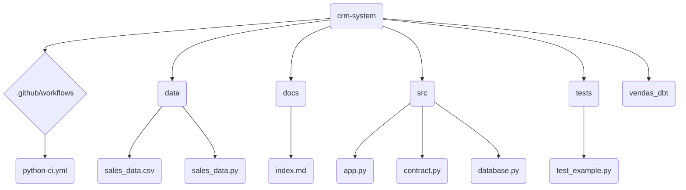

# CRM System - Projeto de Exemplo

## Sobre

Este projeto demonstra um sistema de CRM (Customer Relationship Management) simples construído com Python, utilizando Streamlit para a interface gráfica, PostgreSQL para o banco de dados e Pydantic para validação de dados. O objetivo é fornecer um exemplo completo de um pipeline de dados, desde a geração de dados fictícios até a sua visualização em um dashboard interativo (futuramente em Power BI).


## Estrutura do Projeto (Visual)




## Requisitos

- **Python:** 3.12 (ou versão compatível).
- **Poetry:** Gerenciador de dependências e ambientes virtuais.
- **PostgreSQL:** Banco de dados relacional (instalação orientada abaixo).
- **Psycopg2:** Conector Python para PostgreSQL.
- **Streamlit:** Framework para criação de interfaces web interativas.
- **Pydantic:** Validação de dados.
- **Faker:** Geração de dados fictícios.
- **Pandas:** Manipulação de dados.
- **Pytest:** Framework de testes.
- **Pre-commit:** Ferramentas para formatação e linting de código.
- **Isort:** Formatador de imports.
- **Black:** Formatador de código.
- **Flake8:** Validador de estilo de código.

**Instalação do PostgreSQL:**

Você pode baixar o PostgreSQL para o seu sistema operacional através do link: [PostgreSQL Downloads](https://www.postgresql.org/download/)

Siga as instruções de instalação do instalador para a sua plataforma.


## Instalação e Execução (Método Padrão)

### 1. Clone o repositório

```bash
git clone https://github.com/Jcnok/crm-system.git
cd crm-system
```

### 2. Instale as dependências com Poetry

```bash
poetry install 
```

### 3. Acesse o ambiente virtual do Poetry

```bash
poetry shell
```

### 4. Configure as variáveis de ambiente

Edite o arquivo `.env` na raiz do projeto e defina as variáveis de ambiente do seu banco de dados PostgreSQL:

```
DB_HOST=localhost  # ou o endereço do seu servidor PostgreSQL
DB_NAME=crm_system
DB_USER=seu_usuario
DB_PASS=sua_senha
```

### 5. Crie a tabela de vendas

```bash
poetry run python src/database.py
```

### 6. Execute o Streamlit

```bash
poetry run streamlit run src/app.py
```


Abra seu navegador na URL indicada no console para acessar a interface do Streamlit.


## Funcionalidades

- **Entrada de Dados:** Permite inserir manualmente dados de vendas, incluindo email do vendedor, data, valor, quantidade e produto.
- **Importação de Dados:** Permite importar dados de um arquivo CSV (exemplo: `data/sales_data.csv`).
- **Exclusão de Dados:** Botão para deletar todos os dados do banco de dados (cuidado ao utilizar!).
- **Frontend Simples (Streamlit):** Interface para a inserção e exclusão de dados, servindo como base para um futuro dashboard no Power BI.


## Integração Contínua (CI)

Este projeto inclui uma configuração de CI usando GitHub Actions, automatizando testes e verificação de código em cada push para a branch `main` e pull request. Você pode encontrar a configuração no arquivo `.github/workflows/python-ci.yml`.


## Instalação e Execução (com Docker Compose)

Este projeto também pode ser executado utilizando o Docker Compose. Para isso, certifique-se de ter o Docker e o Docker Compose instalados.

Após clonar o repositório, execute o comando:

```bash
docker-compose up -d
```

Isso iniciará todos os serviços definidos no arquivo `docker-compose.yml` (disponível no GitHub), incluindo o PostgreSQL, o aplicativo Streamlit e a documentação.

Para acessar o aplicativo, abra seu navegador e acesse `http://localhost:8501/`.
A documentação estará disponível em `http://localhost:8000`.


## Links para Ambiente em Nuvem

Para testar o aplicativo e visualizar os resultados, você pode utilizar os seguintes links:

- **Streamlit:** [https://crm-system.streamlit.app/](https://crm-system.streamlit.app/)
- **Documentação:** [https://jcnok.github.io/crm-system/](https://jcnok.github.io/crm-system/)


