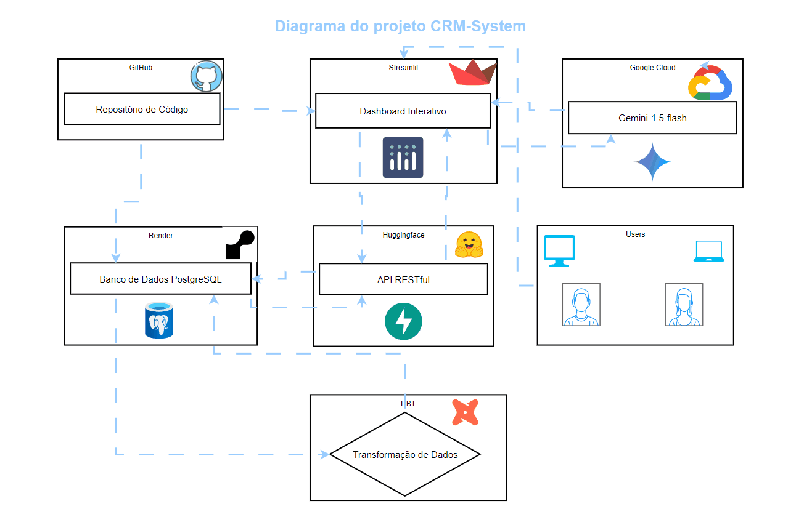

# CRM System - Projeto de Exemplo

## Arquitetura:



## Sobre

O CRM System é uma solução completa para análise de dados de vendas, utilizando uma combinação poderosa de tecnologias para oferecer insights acionáveis e um sistema interativo para gerenciamento de informações. 

O projeto integra:

- **Streamlit:** Interface web interativa com dashboards visuais, gráficos Plotly e um sistema de entrada de dados intuitivo.
- **LangChain:**  Permite que o usuário faça consultas em linguagem natural ao banco de dados, utilizando o modelo de linguagem Gemini-1.5-flash do Google AI.
- **DBT:**  Transforma os dados brutos em diferentes camadas (bronze, silver, gold) para garantir a qualidade e a consistência dos dados, criando views para as KPIs.
- **PostgreSQL:** Banco de dados relacional para armazenamento dos dados.
- **FastAPI:**  API RESTful para fornecer os dados das KPIs em tempo real ao dashboard.

O projeto oferece uma experiência completa, desde a coleta e transformação de dados até a visualização de KPIs e consultas SQL com linguagem natural, proporcionando uma solução eficiente para analisar e gerenciar dados de vendas.

## Links para testar o projeto:

- **Frontend:** https://crm-system.streamlit.app/
- **Backend:** https://jcnok-test1.hf.space/docs
- **Documentação do Banco de dados:** https://jcnok.github.io/crm-system/
- **Documentação do DBT:** https://jcnok.github.io/crm-system/dbt_docs/#!/overview

## Estrutura do Projeto (Visual)

```
crm-system
├── .flake8
├── .gitignore
├── .pre-commit-config.yaml
├── .python-version
├── LICENSE
├── mkdocs.yml
├── poetry.lock
├── pyproject.toml
├── README.md
├── data
│   ├── sales_data.csv
│   └── sales_data.py
├── docs
│   ├── crm_system.html   
│   └── index.md
├── img
│   └── diagrama.gif
├── llm
│   ├── st_llm.py
│   └── teste.py
├── src
│   ├── __init__.py
│   ├── app.py   
│   ├── contract.py
│   ├── crm_api.py
│   ├── dash.py    
│   └── database.py
├── tests
│   └── test_example.py
└── vendas_dbt
    ├── dbt_project.yml
    ├── README.md
    ├── bronze
    │   └── bronze_vendas.sql
    ├── silver
    │   └── silver_vendas.sql
    └── gold
        ├── total_revenue.sql
        ├── total_sales.sql
        ├── average_sale_value.sql
        ├── average_products_per_sale.sql
        ├── average_ticket.sql
        ├── best_selling_product_value.sql
        ├── best_selling_product_quantity.sql
        ├── product_revenue.sql
        ├── top_salesperson_value.sql
        ├── top_salesperson_quantity.sql
        ├── sales_per_salesperson.sql
        ├── revenue_per_salesperson.sql
        ├── sales_per_day.sql
        ├── sales_per_month.sql
        ├── sales_per_year.sql
        ├── revenue_per_day.sql
        ├── revenue_per_month.sql
        ├── revenue_per_year.sql
        └── schema.yml
```

**Explicação das pastas:**

- **`crm-system`:**  A pasta principal do projeto.
- **Configuração:**  Os arquivos `.flake8`, `.gitignore`, `.pre-commit-config.yaml`, `.python-version`, `LICENSE`, `mkdocs.yml`, `poetry.lock` e `pyproject.toml` contêm arquivos de configuração do projeto, como regras de estilo de código, arquivos a serem ignorados pelo Git, configurações de pré-commit, versão do Python e licença.
- **`data`:**  Contém dados de exemplo e scripts para processar os dados.
- **`docs`:**  Contém os arquivos para documentação do projeto, utilizando o MkDocs.
- **`img`:**  Contém imagens e GIFs utilizados no projeto.
- **`llm`:**  Contém o código relacionado à implementação do Chat SQL com a LangChain.
- **`src`:**  Contém o código fonte principal do projeto, organizado em módulos.
- **`tests`:**  Contém os testes unitários do projeto.
- **`vendas_dbt`:**  Contém o código do DBT para transformar os dados de vendas, organizado em camadas (bronze, silver, gold) com seus arquivos SQL.

## Exemplo de Uso:


## Requisitos

- **Python:** 3.12 (ou versão compatível).
- **Poetry:** Gerenciador de dependências e ambientes virtuais.
- **PostgreSQL:** Banco de dados relacional (instalação orientada abaixo).
- **Psycopg2:** Conector Python para PostgreSQL.
- **Streamlit:** Framework para criação de interfaces web interativas.
- **Pydantic:** Validação de dados.
- **Faker:** Geração de dados fictícios.
- **Pandas:** Manipulação de dados.
- **Pytest:** Framework de testes.
- **Pre-commit:** Ferramentas para formatação e linting de código.
- **Isort:** Formatador de imports.
- **Black:** Formatador de código.
- **Flake8:** Validador de estilo de código.

**Instalação do PostgreSQL:**

Você pode baixar o PostgreSQL para o seu sistema operacional através do link: [PostgreSQL Downloads](https://www.postgresql.org/download/)

Siga as instruções de instalação do instalador para a sua plataforma.


## Instalação e Execução (Método Padrão)

### 1. Clone o repositório

```bash
git clone https://github.com/Jcnok/crm-system.git
cd crm-system
```

### 2. Instale as dependências com Poetry

```bash
poetry install 
```

### 3. Acesse o ambiente virtual do Poetry

```bash
poetry shell
```

### 4. Configure as variáveis de ambiente

Edite o arquivo `.env` na raiz do projeto e defina as variáveis de ambiente do seu banco de dados PostgreSQL:

```
DB_HOST=localhost  # ou o endereço do seu servidor PostgreSQL
DB_NAME=crm_system
DB_USER=seu_usuario
DB_PASS=sua_senha
```

### 5. Crie a tabela de vendas

```bash
poetry run python src/database.py
```

### 6. Execute o Streamlit

```bash
poetry run streamlit run src/app.py
```


Abra seu navegador na URL indicada no console para acessar a interface do Streamlit.


## Funcionalidades

- **Entrada de Dados:** Permite inserir manualmente dados de vendas, incluindo email do vendedor, data, valor, quantidade e produto.
- **Importação de Dados:** Permite importar dados de um arquivo CSV (exemplo: `data/sales_data.csv`).
- **Exclusão de Dados:** Botão para deletar todos os dados do banco de dados (cuidado ao utilizar!).
- **Frontend Simples (Streamlit):** Interface para a inserção e exclusão de dados, servindo como base para um futuro dashboard no Power BI.


## Integração Contínua (CI)

Este projeto inclui uma configuração de CI usando GitHub Actions, automatizando testes e verificação de código em cada push para a branch `main` e pull request. Você pode encontrar a configuração no arquivo `.github/workflows/python-ci.yml`.


## Instalação e Execução (com Docker Compose)

Este projeto também pode ser executado utilizando o Docker Compose. Para isso, certifique-se de ter o Docker e o Docker Compose instalados.

Após clonar o repositório, execute o comando:

```bash
docker-compose up -d
```

Isso iniciará todos os serviços definidos no arquivo `docker-compose.yml` (disponível no GitHub), incluindo o PostgreSQL, o aplicativo Streamlit e a documentação.

Para acessar o aplicativo, abra seu navegador e acesse `http://localhost:8501/`.
A documentação estará disponível em `http://localhost:8000`.


## Links para Ambiente em Nuvem

Para testar o aplicativo e visualizar os resultados, você pode utilizar os seguintes links:

- **Streamlit:** [https://crm-system.streamlit.app/](https://crm-system.streamlit.app/)
- **Documentação:** [https://jcnok.github.io/crm-system/](https://jcnok.github.io/crm-system/)


