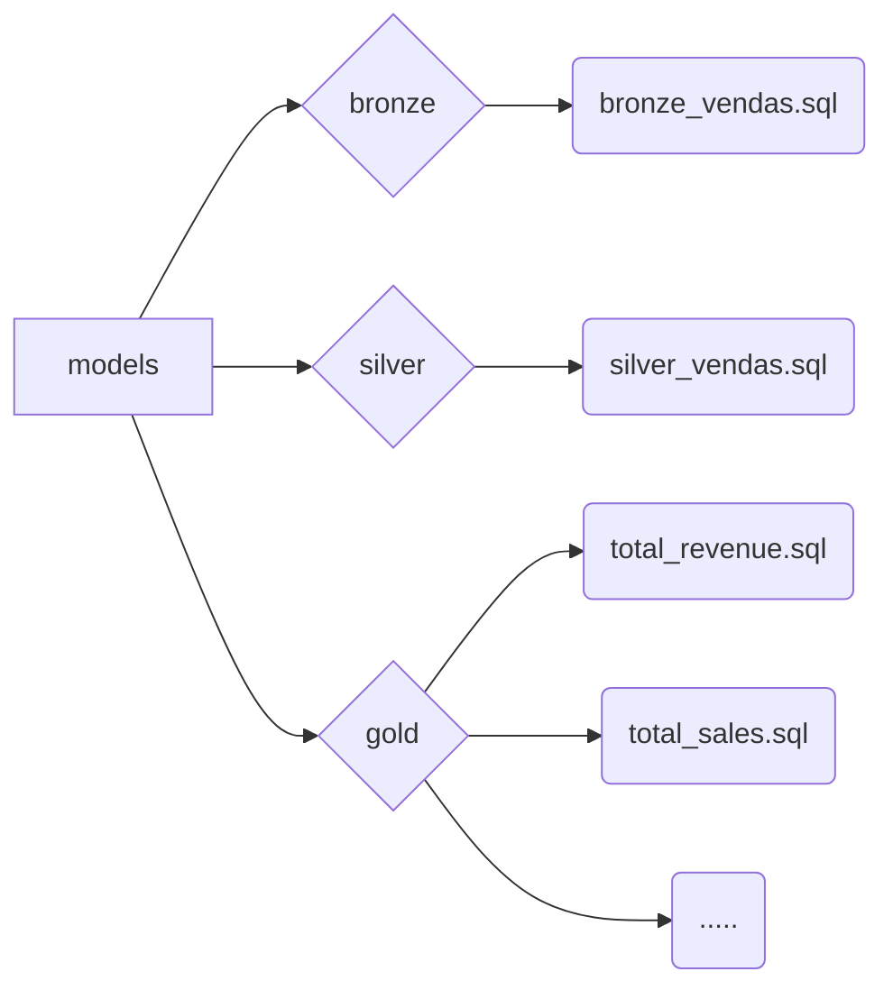

## DBT: Transformando Dados em Insights para Negócios

Este projeto demonstra o poder do DBT, uma ferramenta de transformação de dados que permite aos engenheiros de dados construir pipelines robustos, testáveis e documentados para extrair insights acionáveis dos dados.

###  Sobre o Projeto

Imagine um sistema de CRM que coleta dados de vendas de uma empresa. Esses dados brutos, como emails, datas, valores, quantidades e produtos, são valiosos, mas precisam ser transformados para gerar insights significativos. É aí que o DBT entra em cena.

###  Estrutura do Projeto (DBT)



###  Replicando o Projeto

1. **Acesse a pasta do projeto**
   
   - Inicialize um projeto DBT:
     ```bash
     cd vendas_dbt

2. **Construindo o Pipeline:**
   - Execute os comandos:
     ```bash
     dbt build
     dbt run
     ```

3. **Documentação:**
   - Gere a documentação:
     ```bash
     dbt docs generate
     ```
   - Acesse a documentação gerada:
     ```bash
     dbt docs serve
     ```

### Conclusão

O DBT transforma o processo de transformação de dados em uma experiência poderosa e eficiente. Com o DBT, engenheiros de dados podem construir pipelines de transformação robustos, testáveis e documentados, garantindo a qualidade e a confiabilidade dos dados. Os insights gerados pelo DBT podem ser utilizados para tomar decisões estratégicas, otimizar processos e impulsionar o crescimento do negócio.

